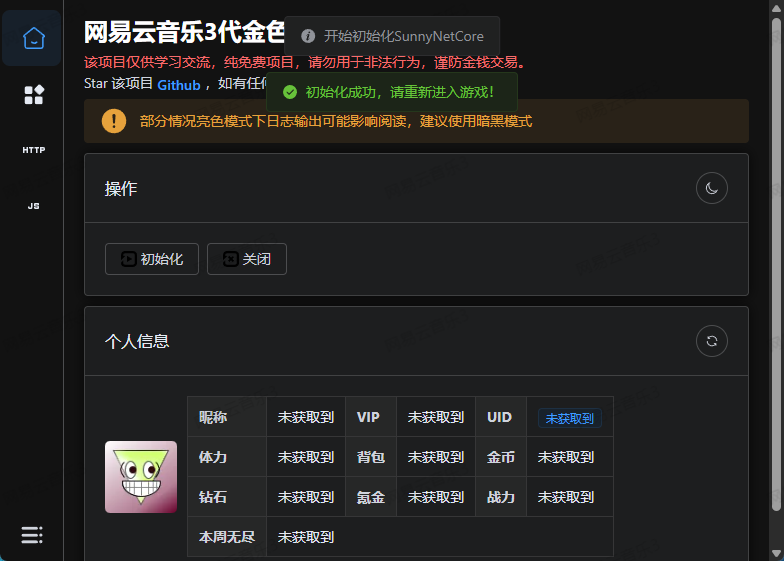

# 快速开始

## 下载

### 前置准备

`Windows 7`用户，可能需要安装 [Webview2 Download](https://developer.microsoft.com/zh-cn/microsoft-edge/webview2/consumer/) 才可以正常运行。


::: details 无法创建`Cache`目录？
请确认你的程序路径没有中文并且是解压后运行的，请不要在压缩包内直接运行。
:::

::: tip 注意
`Webview2`仅用于提供用户程序界面渲染，`Windows 10`及以上系统自带所以无需手动安装。
:::

### 安装

前往 [Github Releases](https://github.com/LauZzL/leitingzhanji-ui/releases) 下载最新版本。

1. 解压到不含中文路径的任意目录(尽量不要在系统盘)。
2. 运行`LTZJ-NEM.exe`即可。


## 使用

1. 点击`初始化按钮`



2. 当看到提示成功后重新打开小程序进入游戏

3. 等待个人信息成功加载


当你看到个人信息后就代表获取成功。

## 文件结构

```
.
├─ Cache // 程序缓存目录
├─ custom_packet // 流程封包目录
│  ├─ [可编辑]领取免费礼包.nem
├─ scripts // JavaScript 扩展脚本目录
│  ├─ 一键海盗宝箱.njs
└─ ...
```
