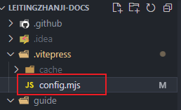
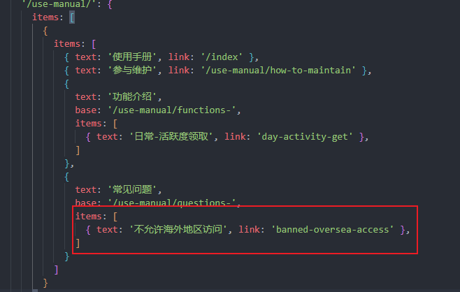

# 如何参与维护该页面内容？

1. fork [https://github.com/LauZzL/leitingzhanji-docs](https://github.com/LauZzL/leitingzhanji-docs) 仓库
2. 将 fork 的仓库 clone 到本地
3. 在本地修改文档，提交到自己的仓库
4. 提交 pull request 到 [https://github.com/LauZzL/leitingzhanji-docs](https://github.com/LauZzL/leitingzhanji-docs)
5. 等待管理员验证后合并

## 提交规范

1. 提交前请先同步最新代码
2. 图片资源应当放入`image`文件并命名或使用图床链接

## 添加一个功能介绍

1. 首先需要打开`.vitepress/config.mjs`文件，并在图中标注的部分添加侧边栏内容




::: tip
你的link值应该为去掉固定前缀`functions-`的文件名。
:::

```javascript
// 添加一个新的功能介绍
{
    text: '功能介绍',
    base: '/use-manual/functions-',
    items: [
        { text: '日常-活跃度领取', link: 'day-activity-get' },
        { text: '这是一个新的功能介绍', link: 'this-is-a-new-function' },
    ]
}
```

2. 在`use-manual`文件夹新建一个md文档，该文档命名需要为固定前缀`functions-`+在`config.mjs`中添加的`link`值，例如：`functions-this-is-a-new-function.md`
3. 添加文档内容，并提交到自己的仓库
4. 提交 pull request 到 [https://github.com/LauZzL/leitingzhanji-docs](https://github.com/LauZzL/leitingzhanji-docs)
5. 等待管理员验证后合并


## 添加一个常见问题

1. 首先需要打开`.vitepress/config.mjs`文件，并在图中标注的部分添加侧边栏内容



::: tip
你的link值应该为去掉固定前缀`questions-`的文件名。
:::

```javascript
// 添加一个新的常见问题
{
    text: '常见问题',
    base: '/use-manual/questions-',
    items: [
        { text: '不允许海外地区访问', link: 'banned-oversea-access' },
        { text: '这是一个新的常见问题', link: 'this-is-a-new-question' },
    ]
}
```

2. 在`use-manual`文件夹新建一个md文档，该文档命名需要为固定前缀`questions-`+在`config.mjs`中添加的`link`值，例如：`questions-this-is-a-new-question.md`
3. 添加文档内容，并提交到自己的仓库
4. 提交 pull request 到 [https://github.com/LauZzL/leitingzhanji-docs](https://github.com/LauZzL/leitingzhanji-docs)
5. 等待管理员验证后合并